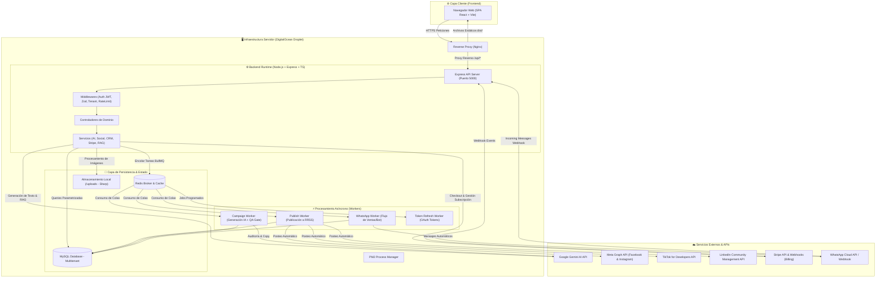

# 🏛️ Arquitectura del Sistema — Smart Publish

> **Smart Publish** es una plataforma SaaS B2B2C de gestión, automatización de marketing y publicación inteligente en redes sociales, potenciada por agentes de inteligencia artificial (Google Gemini), procesamiento asíncrono en colas (BullMQ + Redis) y un inbox conversacional multicanal con CRM integrado.

---

## 1. Diagrama de Arquitectura Global



---

## 2. Estructura del Monorepo

El repositorio está organizado con una separación limpia entre frontend, backend y documentación funcional:

```
Smart-publish/
├── smart/                  # 🌐 Frontend SPA (React + TypeScript + Vite + Tailwind)
│   ├── src/
│   │   ├── components/     # Componentes reutilizables (Sidebar, Layouts, UI, etc.)
│   │   ├── contexts/       # React Contexts (AuthContext, WorkspaceContext)
│   │   ├── pages/          # Vistas principales (Dashboard, CRM, Composer, etc.)
│   │   ├── lib/            # Utilidades, cliente Axios, helpers
│   │   ├── App.tsx         # Enrutador principal y layout
│   │   └── index.css       # Design System Tokens y estilos base
│   ├── package.json
│   └── tailwind.config.js
│
├── backend/                # ⚙️ Backend API (Node.js + Express + TypeScript + MySQL)
│   ├── src/
│   │   ├── config/         # Conexión MySQL, Redis, variables de entorno
│   │   ├── controllers/    # Manejadores de rutas HTTP
│   │   ├── domain/         # Tipos y entidades de dominio
│   │   ├── middlewares/    # Autenticación, validación Zod, tenant, rate limiting
│   │   ├── repositories/   # Acceso a base de datos (queries parametrizadas)
│   │   ├── routes/         # Definición de endpoints y agrupaciones REST
│   │   ├── schemas/        # Esquemas de validación Zod para payloads
│   │   ├── services/       # Lógica de negocio (AI, Facebook, Stripe, RAG, Queue)
│   │   ├── workers/        # Workers de BullMQ (publicación, campañas, whatsapp)
│   │   └── app.ts          # Inicialización de Express y arranque del servidor
│   ├── dist/               # Código compilado a JavaScript (ejecutado por PM2)
│   ├── package.json
│   └── tsconfig.json
│
└── docs/                   # 📚 Documentación técnica, diseño de agentes y guías
```

---

## 3. Capa Frontend (`smart/`)

### Stack Tecnológico
- **Framework:** React 18+ con TypeScript.
- **Bundler:** Vite (generación rápida y optimizada para producción).
- **Estilos:** Tailwind CSS con un Design System semántico centralizado.
- **Iconografía:** `lucide-react`.
- **Navegación:** `react-router-dom` con rutas protegidas según sesión y rol.

### Vistas y Módulos Principales
1. **Dashboard (`Dashboard.tsx`):** Métricas clave de rendimiento, estado de redes vinculadas y actividad reciente.
2. **Post Composer (`Composer.tsx`):** Creación y programación de publicaciones con asistente de copy por IA y vista previa multirred.
3. **Calendario (`Calendar.tsx`):** Vista cronológica mensual/semanal de contenidos programados y publicados.
4. **Campañas de Marketing (`Campaigns.tsx`):** Planificación de secuencias de contenido automatizadas por IA.
5. **CRM & Leads (`CRM.tsx`):** Pipeline de prospectos con embudos de venta, origen y seguimiento.
6. **Catálogo de Productos (`Catalog.tsx`):** Inventario de productos/servicios con precios para cotización directa.
7. **Cotizaciones (`Quotes.tsx`):** Generador de cotizaciones vinculadas a clientes del CRM.
8. **WhatsApp Inbox (`WhatsAppInbox.tsx`):** Bandeja conversacional con historial de chat y soporte de respuestas sugeridas por agente IA.
9. **AI Observability (`AiObservability.tsx`):** Monitor de consumo de tokens, latencias y llamadas al modelo Gemini.
10. **Facturación & Planes (`Billing.tsx`):** Integración con portal de clientes de Stripe para suscripciones.

### Sistema de Diseño (Tokens Semánticos)
Configurados en `tailwind.config.js` para consistencia visual:
- `canvas`: Fondo de la interfaz.
- `surface` / `surface-raised`: Contenedores y tarjetas con elevación.
- `borderc`: Bordes suaves para delimitación de componentes.
- `text-primary` / `text-secondary`: Jerarquía tipográfica.
- `accent` (`#...` Azul): Exclusivo para CTA principal y navegación activa.
- `purple`: Exclusivo para funcionalidades y badges impulsados por IA.

---

## 4. Capa Backend (`backend/`)

### Stack Tecnológico
- **Runtime:** Node.js (v20+ LTS).
- **Framework Web:** Express.js con TypeScript.
- **Validación de Datos:** `zod` para validación estricta de esquemas de entrada.
- **Seguridad:** `helmet`, `cors`, `bcrypt` y `express-rate-limit`.
- **Autenticación:** JSON Web Tokens (`jsonwebtoken`) con expiración y control de sesiones.
- **Subida y Procesamiento de Multimedia:** `multer` y optimización con `sharp`.

### Patrón Arquitectónico por Capas
```
Petición HTTP 
   ⬇
[Rate Limiting & Helmet] 
   ⬇
[Auth Middleware (JWT)] ➔ Extrae req.user y req.user.workspace_id
   ⬇
[Validate Middleware (Zod)] ➔ Valida y limpia el body/query
   ⬇
[Controller] ➔ Orquesta la petición y responde al cliente
   ⬇
[Service] ➔ Aplica lógica de negocio, IA, colas o APIs externas
   ⬇
[Repository / Database] ➔ Ejecuta consultas SQL seguras y parametrizadas
```

### Endpoints Principales (`/api/*`)
| Módulo | Prefijo de Ruta | Descripción |
|---|---|---|
| Autenticación | `/api/auth` | Registro, login con rate limit estricto, refresh token |
| Redes Sociales | `/api/social/facebook`, `/tiktok`, `/linkedin` | OAuth, vinculación de cuentas y métricas |
| Publicaciones | `/api/posts` | Creación, edición, listado y programación de publicaciones |
| Agentes e IA | `/api/ai` | Generación de copy, ideas, hashtags y consultas RAG |
| Automatización | `/api/automation` | Reglas de auto-publicación y triggers |
| CRM | `/api/crm` | Contactos, etapas de embudo, notas y scoring |
| Catálogo | `/api/catalog` | Items, servicios, SKUs y precios |
| Cotizaciones | `/api/quotes` | Creación y cálculo de cotizaciones comerciales |
| Conversaciones | `/api/conversations` | Mensajería de WhatsApp, chats y webhooks entrantes |
| Facturación | `/api/billing` | Checkout sessions de Stripe, webhook de pagos y suscripción |
| Observabilidad | `/api/observability` | Logs de auditoría, métricas de IA y salud del sistema |

---

## 5. Procesamiento Asíncrono y Colas (BullMQ + Redis)

Para evitar bloqueos en el hilo principal de Express durante operaciones lentas (llamadas a modelos de IA o APIs de redes sociales), se utiliza **BullMQ** sobre **Redis**:

1. **`publish.worker.ts`**:
   - Monitorea publicaciones con fecha y hora programada.
   - Realiza la subida de imágenes y texto a las Graph APIs de Facebook, Instagram, LinkedIn y TikTok.
   - Actualiza el estado de la publicación a `PUBLISHED` o `FAILED` con mensaje de error descriptivo.
2. **`campaign.worker.ts`**:
   - Genera secuencias completas de contenido a través de Gemini.
   - **QA Gate:** Ejecuta hasta 3 rondas de auditoría automática de calidad. Si el contenido no cumple los criterios, se guarda como `DRAFT` para revisión humana obligatoria.
3. **`whatsapp.worker.ts`**:
   - Procesa webhooks de mensajes entrantes de WhatsApp.
   - Invoca el orquestador de IA para clasificar la intención del cliente (atención, venta, consulta técnica) y preparar la respuesta correspondiente.
4. **`token-refresh.worker.ts`**:
   - Tarea periódica (`node-cron`) para refrescar tokens OAuth antes de su caducidad.

---

## 6. Inteligencia Artificial y RAG (`services/ai.service.ts` & `rag.service.ts`)

- **Motor Central:** Google Gemini (SDK `@google/generative-ai`).
- **Resiliencia:** Timeout configurado con estrategia de circuit breaker para evitar colapso si la API externa experimenta lentitud.
- **RAG (Retrieval-Augmented Generation):** Permite al modelo responder preguntas basándose en el catálogo, información de la empresa y base de conocimientos específica de cada cliente/workspace.

---

## 7. Modelo de Seguridad y Multitenancy

1. **Aislamiento Multitenant Estricto:**
   - La frontera de aislamiento es `workspace_id`.
   - **Regla de Oro:** El `workspace_id` proviene **únicamente del token JWT verificado** en el backend (`req.user.workspace_id`), nunca de parámetros manipulables por el cliente como `req.body.workspaceId` o headers no confiables.
2. **Prevención de Inyecciones SQL:**
   - 100% de las consultas utilizan placeholders (`?`) mediante el driver `mysql2`.
3. **Cero Secretos Hardcodeados:**
   - Variables críticas como `JWT_SECRET`, `STRIPE_WEBHOOK_SECRET` y credenciales de BD provocan parada controlada inmediata (`process.exit(1)`) si no están presentes en el entorno.
4. **Verificación Criptográfica de Webhooks:**
   - Stripe Webhooks valida la firma HMAC con `stripe.webhooks.constructEvent`.
   - Meta Webhooks valida tokens de verificación (`hub.verify_token`).

---

## 8. Entorno de Despliegue en Producción

### Especificaciones del Servidor
- **Proveedor:** DigitalOcean Droplet.
- **Sistema Operativo:** Ubuntu Linux.
- **Gestor de Procesos:** PM2 (administra el proceso de Node `smart-publish-backend` en puerto 5000 y workers asociados).
- **Servidor Web / Proxy:** Nginx configurado para:
  - Servir la SPA estática compilada desde `/var/www/html` (`index.html`, `assets/`).
  - Redirigir peticiones API (`/api/`) al puerto interno `5000`.
  - Terminación SSL/HTTPS con certificados Let's Encrypt.
- **Base de Datos:** MySQL Server escuchando en socket/puerto local protegido.
- **Broker de Colas:** Redis Server en puerto `6379`.

---

*Documento generado y mantenido para el ecosistema Smart Publish.*
