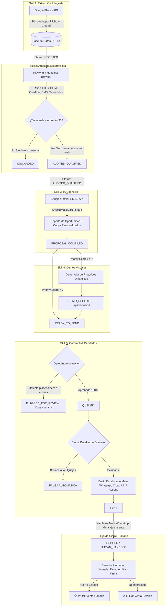

# 📘 Documentación Técnica & Estructura del Sistema — Agente Autónomo de Prospección B2B v3.0

**Versión:** 3.0.0 (Producción)  
**URL de Producción:** [https://agente.inversionesvawi.com/](https://agente.inversionesvawi.com/)  
**Filosofía Operativa:** *El agente autónomo busca, audita, diagnostica y contacta; el humano negocia, demuestra y cierra.*  

---

## 📑 Tabla de Contenidos

1. [Resumen Ejecutivo y Filosofía](#1-resumen-ejecutivo-y-filosofía)
2. [Diagrama de Arquitectura Global](#2-diagrama-de-arquitectura-global)
3. [Máquina de Estados Finita (16 Estados Idempotentes)](#3-máquina-de-estados-finita-16-estados-idempotentes)
4. [Especificación de las 5 Skills del Agente](#4-especificación-de-las-5-skills-del-agente)
   - [Skill 1: Lead Hunter & Discovery](#skill-1-lead-hunter--discovery)
   - [Skill 2: Deterministic Web Auditor (Playwright)](#skill-2-deterministic-web-auditor-playwright)
   - [Skill 3: Cognitive Opportunity Evaluator (Google Gemini)](#skill-3-cognitive-opportunity-evaluator-google-gemini)
   - [Skill 4: Mockup & Demo Builder](#skill-4-mockup--demo-builder)
   - [Skill 5: Multi-Channel Outreach Engine & Circuit Breaker](#skill-5-multi-channel-outreach-engine--circuit-breaker)
5. [Candados de Seguridad Anti-Baneo de WhatsApp (Meta Compliance)](#5-candados-de-seguridad-anti-baneo-de-whatsapp-meta-compliance)
6. [Esquema de Base de Datos y Modelos](#6-esquema-de-base-de-datos-y-modelos)
7. [Control Center Dashboard (Frontend Kanban)](#7-control-center-dashboard-frontend-kanban)
8. [Estructura de Directorios del Código](#8-estructura-de-directorios-del-código)
9. [Configuración de Variables de Entorno (.env)](#9-configuración-de-variables-de-entorno-env)
10. [Endpoints de la API y Webhooks](#10-endpoints-de-la-api-y-webhooks)
11. [Deuda Técnica Consciente & Plan de Escalabilidad a Fase 2](#11-deuda-técnica-consciente--plan-de-escalabilidad-a-fase-2)

---

## 1. Resumen Ejecutivo y Filosofía

El **Agente de Prospección B2B v3.0** es una plataforma de software autónoma diseñada para eliminar el 95% del trabajo manual repetitivo en prospección técnica comercial:

* **Lo que hace el Agente:** Búsqueda en Google Maps $\rightarrow$ Auditoría técnica profunda con Playwright (velocidad TTFB, responsive, stack) $\rightarrow$ Diagnóstico y copy persuasivo con IA (Google Gemini Structured Outputs) $\rightarrow$ Filtro de calidad anti-alucinación $\rightarrow$ Primer contacto oficial por WhatsApp y Correo.
* **Lo que hace el Humano (*Human Handoff*):** En cuanto el prospecto responde (`REPLIED`), el agente **cede el control total al cerrador humano**. El agente no negocia precios ni improvisa en chats abiertos; registra la respuesta, notifica al equipo comercial y espera el resultado final (`WON` o `LOST`).

---

## 2. Diagrama de Arquitectura Global



---

## 3. Máquina de Estados Finita (16 Estados Idempotentes)

Cada transición se realiza de forma atómica en la base de datos mediante:  
`UPDATE prospect_leads SET status = 'NUEVO' WHERE id = 'ID' AND status = 'ANTERIOR'`  
Esto garantiza que ningún worker ni reintento reprocese un prospecto dos veces en la misma etapa.

```
1.  INGESTED            ──► Lead extraído de Google Maps, listo para auditoría.
2.  AUDITED_QUALIFIED   ──► Web auditada con incidencias detectadas (o sin web).
3.  DISCARDED           ──► Descartado por web perfecta (score >= 90) o fallos tras 2 reintentos.
4.  AUDIT_FAILED        ──► Error de conectividad temporal durante la auditoría.
5.  PROPOSAL_COMPILED   ──► Oportunidad evaluada y copy redactado por IA.
6.  DEMO_DEPLOYED       ──► Prototipo interactivo generado para leads de alto ticket (score >= 7).
7.  READY_TO_SEND       ──► Propuesta compilada lista para validación de calidad.
8.  FLAGGED_FOR_REVIEW  ──► Bloqueado por el Gate Anti-Alucinación (requiere aprobación humana).
9.  QUEUED              ──► Encolado y listo para despacho escalonado.
10. SENT                ──► Primer mensaje enviado vía WhatsApp oficial o Correo.
11. FOLLOWUP_SENT       ──► Primer seguimiento automático tras 48h sin respuesta.
12. FOLLOWUP_2          ──► Segundo seguimiento automático tras 72h.
13. COLD                ──► Archivado en frío tras agotar secuencia de seguimiento.
14. REPLIED             ──► El prospecto respondió el mensaje.
15. HUMAN_HANDOFF       ──► Control 100% transferido al cerrador humano.
16. WON / LOST          ──► Resultado comercial final registrado.
```

---

## 4. Especificación de las 5 Skills del Agente

### Skill 1: Lead Hunter & Discovery
* **Fuente:** Google Places API (Text Search & Place Details).
* **Campos Extraídos:** Nombre comercial, dirección, teléfono internacional/WhatsApp, URL de web actual, rating de estrellas (★), total de reseñas y `place_id`.
* **Idempotencia:** Constraint `UNIQUE(place_id)` para prevenir duplicados.
* **Salida:** Lead creado con estado `INGESTED`.

### Skill 2: Deterministic Web Auditor (Playwright)
* **Motor:** Chromium Headless en emulación móvil (iPhone SE / 375x667px).
* **Métricas Deterministas:**
  * **TTFB (Time to First Byte):** Tiempo en milisegundos que tarda el servidor en responder el primer byte.
  * **Carga Total:** Tiempo hasta el evento `domcontentloaded`.
  * **Auditoría Móvil:** Detección de desbordamiento horizontal (`scrollWidth > innerWidth + 10px`) y presencia de `viewport meta`.
  * **Seguridad SSL:** Detección de certificado HTTPS.
  * **Stack Tecnológico:** Detección de WordPress, Elementor, Divi, WooCommerce, Shopify, Wix, Squarespace, jQuery.
  * **Capturas Reales:** Generación automática de screenshot JPEG en `/storage/screenshots/{leadId}.jpg`.
* **Clasificación:**
  * Si no tiene web $\rightarrow$ Oportunidad `NEW_WEBSITE` (Score 9/10).
  * Si TTFB > 1.5s o no es responsive $\rightarrow$ Oportunidad `MODERNIZATION` o `PERFORMANCE_OVERHAUL`.
  * Si score >= 90 y rápida $\rightarrow$ `DISCARDED` (se descarta para no perder tiempo en clientes sin dolor).

### Skill 3: Cognitive Opportunity Evaluator (Google Gemini API)
* **Motor:** Google Gemini API (`gemini-1.5-flash` o `gemini-2.0-flash`) con salida estructurada JSON (`response_mime_type: "application/json"`).
* **Fallback:** OpenAI (`gpt-4o-mini`) y Generador Heurístico Determinista sin fallos.
* **Esquema Estricto JSON:**
  ```json
  {
    "opportunity_type": "NEW_WEBSITE | MODERNIZATION | PERFORMANCE_OVERHAUL | SYSTEM_INTEGRATION",
    "priority_score": 1-10,
    "pain_points": ["punto 1", "punto 2", "punto 3"],
    "proposed_solution": "solución técnica adaptada",
    "outreach_copy": {
      "whatsapp_pitch": "pitch conversacional corto",
      "email_subject": "asunto llamativo",
      "email_body": "cuerpo formal firmado por el cerrador"
    }
  }
  ```
* **Regla Anti-Alucinación:** Cita únicamente métricas reales extraídas por Playwright y el nombre exacto de la empresa.

### Skill 4: Mockup & Demo Builder
* **Condición de Disparo:** Prospectos con `priority_score >= 7`.
* **Entrega:** Genera un prototipo dinámico accesible en `/api/demos/{leadId}` con diseño moderno, comparativa de velocidad antes/después, botón directo de WhatsApp y adaptación responsive.

### Skill 5: Multi-Channel Outreach Engine & Circuit Breaker
* **Gate Previo Anti-Alucinación:** Valida antes del envío que el mensaje no contenga texto sin reemplazar (`[Nombre]`, `{Empresa}`, `{{url}}`, `undefined`, `null`), longitud mínima y que no esté en lista de exclusión (`do_not_contact`).
* **WhatsApp Cloud API Oficial:** Envío mediante `graph.facebook.com/v20.0/{PHONE_NUMBER_ID}/messages` utilizando plantillas oficiales pre-aprobadas (`first_contact_audit_v1` o `hello_world`).
* **Resend Email API:** Envío de correos corporativos en formato HTML responsivo para prospectos con email registrado.
* **Circuit Breaker:** Monitorea la tasa de rebote (`bounce_rate_24h`). Si supera el 5%, los envíos se pausan automáticamente para proteger la reputación.

---

## 5. Candados de Seguridad Anti-Baneo de WhatsApp (Meta Compliance)

Para operar de forma 100% segura y evitar bloqueos en WhatsApp:

1. **Uso Exclusivo de la Cloud API Oficial de Meta:** Prohibido el uso de librerías no autorizadas (como Baileys o Puppeteer sobre WhatsApp Web). Meta nunca banea por llamadas a su propia API oficial.
2. **Ventana de 24 Horas & Plantillas Pre-Aprobadas:**
   * Primer contacto en frío $\rightarrow$ **Obligatorio usar plantillas aprobadas por Meta** (`template`), nunca texto libre.
   * Texto libre $\rightarrow$ Solo permitido después de que el cliente responde (dentro de las 24h de sesión).
3. **Calentamiento Gradual del Número (*Warmup*):**
   * *Semana 1:* Máximo 15-25 envíos/día con pausas entre cada mensaje.
   * *Semana 2:* Escalar a 50 envíos/día a medida que Meta otorga el Tier 1 (1,000 conversaciones/día).
4. **Monitoreo de Calidad (*Quality Rating*):** El sistema mantiene la calidad en **Verde (GREEN)** asegurando que los mensajes contengan diagnósticos verídicos y relevantes para el receptor.
5. **Separación de Canales:** Resend Email actúa como canal alternativo en caso de contingencia.

---

## 6. Esquema de Base de Datos y Modelos

### Tabla: `prospect_leads`
| Campo | Tipo | Descripción |
|---|---|---|
| `id` | UUID (PK) | Identificador único del lead |
| `place_id` | VARCHAR (UNIQUE) | ID de Google Places para evitar duplicados |
| `business_name` | VARCHAR | Nombre comercial de la empresa |
| `niche` | VARCHAR | Nicho o rubro comercial |
| `phone` | VARCHAR | Teléfono nacional / internacional |
| `whatsapp` | VARCHAR | Número formateado para WhatsApp |
| `email` | VARCHAR | Correo electrónico de contacto |
| `google_maps_url`| TEXT | Enlace directo a la ficha de Google Maps |
| `rating` | DECIMAL | Puntuación de estrellas (1.0 - 5.0) |
| `reviews_count` | INTEGER | Número total de valoraciones públicas |
| `current_website_url` | TEXT | URL del sitio web actual del negocio |
| `status` | lead_status | Estado actual en la máquina de estados |
| `retry_count` | INTEGER | Contador de reintentos de auditoría (máx 2) |
| `do_not_contact` | BOOLEAN | Bandera de exclusión de envíos |
| `assigned_closer`| VARCHAR | Nombre de la persona asignada al cierre |

### Tabla: `audit_diagnostics`
| Campo | Tipo | Descripción |
|---|---|---|
| `id` | UUID (PK) | Identificador del diagnóstico |
| `lead_id` | UUID (FK) | Relación con `prospect_leads` |
| `has_website` | BOOLEAN | Indica si tiene presencia web propia |
| `is_mobile_responsive` | BOOLEAN | Resultado del test de adaptabilidad móvil |
| `lighthouse_perf_score` | INTEGER | Puntuación de rendimiento (0 - 100) |
| `ttfb_ms` | INTEGER | Tiempo de respuesta del servidor en ms |
| `load_time_ms` | INTEGER | Tiempo total de carga |
| `screenshot_path` | TEXT | Ruta de la captura de pantalla guardada |
| `detected_tech_stack` | JSON | CMS, builders y tecnologías detectadas |
| `issues_found` | JSON | Lista de puntos de dolor técnicos encontrados |
| `ai_opportunity_type` | VARCHAR | Oportunidad primaria de negocio |
| `demo_url_deployed` | TEXT | Enlace al prototipo interactivo generado |

### Tabla: `proposals`
| Campo | Tipo | Descripción |
|---|---|---|
| `id` | UUID (PK) | Identificador de la propuesta |
| `lead_id` | UUID (FK) | Relación con `prospect_leads` |
| `opportunity_type` | VARCHAR | Tipo de solución propuesta |
| `priority_score` | INTEGER | Prioridad comercial (1 - 10) |
| `pain_points` | JSON | Puntos de dolor citados en el mensaje |
| `proposed_solution` | TEXT | Resumen de la solución técnica |
| `whatsapp_pitch` | TEXT | Pitch conversacional generado para WhatsApp |
| `email_subject` | TEXT | Asunto del correo electrónico |
| `email_body` | TEXT | Cuerpo completo del correo electrónico |
| `gate_passed` | BOOLEAN | Indica si pasó la validación anti-alucinación |
| `gate_review_notes` | TEXT | Notas de revisión del Gate |

### Tabla: `outreach_results` (Feedback Loop & Rendimiento)
| Campo | Tipo | Descripción |
|---|---|---|
| `id` | UUID (PK) | Identificador del resultado de outreach |
| `lead_id` | UUID (FK) | Relación con `prospect_leads` |
| `channel` | VARCHAR | Canal de contacto (`whatsapp` o `email`) |
| `sent_at` | TIMESTAMP | Marca de tiempo de envío efectivo |
| `replied` | BOOLEAN | Indica si el prospecto respondió |
| `converted` | BOOLEAN | Indica si la respuesta se convirtió en cierre |
| `copy_used` | TEXT | Copy exacto enviado (alimenta few-shots de IA) |
| `notes` | TEXT | Notas de entrega / metadata |

### Tabla: `domain_health` (Circuit Breaker & Reputación)
| Campo | Tipo | Descripción |
|---|---|---|
| `id` | UUID (PK) | Identificador de estado de dominio |
| `domain` | VARCHAR | Dominio monitoreado |
| `bounce_rate_24h` | REAL | Tasa de rebote en las últimas 24h |
| `spam_complaints` | INTEGER | Quejas de spam registradas |
| `circuit_breaker_active` | BOOLEAN | Bandera de suspensión automática preventiva |
| `checked_at` | TIMESTAMP | Última verificación de salud |

---

## 7. Control Center Dashboard (Frontend Kanban)

El panel accesible en `https://agente.inversionesvawi.com/` cuenta con:

* **Barra de Métricas en Tiempo Real:** Total Leads, Auditados Playwright, Revisión Humana (Gate), Human Handoff (Respuestas) y Ventas Ganadas (`WON`).
* **Tablero Kanban de 5 Columnas:**
  1. **Ingesta & Auditoría:** Leads recién importados y en proceso de análisis Playwright.
  2. **Propuestas & Gate:** Propuestas redactadas por Gemini y filtradas por el Gate.
  3. **Outreach & Envíos:** Mensajes encolados y enviados con éxito (`SENT`).
  4. **Human Handoff (Cierre):** Prospectos que respondieron, listos para llamada/cierre.
  5. **Resultados Finales:** Ventas cerradas (`WON`) y descartadas (`LOST`/`DISCARDED`).
* **Modal de Detalle & Diagnóstico:** Visualización de métricas de Playwright, captura web, pitch de WhatsApp, correo generado y botones de acción rápida.

---

## 8. Estructura de Directorios del Código

```
/var/www/agente-v3/
├── .env                              # Variables de entorno principales del agente
├── ecosystem.config.cjs              # Configuración de PM2 para servicio continuo
├── package.json                      # Dependencias (Playwright, Express, SQLite, TSX)
├── tsconfig.json                     # Configuración de compilación TypeScript
├── dist/                             # Código compilado a JavaScript listo para producción
├── storage/                          # Almacenamiento persistente
│   ├── database.sqlite               # Base de datos SQLite
│   └── screenshots/                  # Capturas web generadas por Playwright
├── src/
│   ├── cli.ts                        # Ejecutable CLI por línea de comandos
│   ├── config/
│   │   └── env.ts                    # Carga y tipado estricto de variables de entorno
│   ├── db/
│   │   ├── database.ts               # Conexión SQLite con WAL mode
│   │   ├── schema.sql                # Esquema DDL de tablas
│   │   └── repositories/             # Capa de acceso a datos (leads, audits, proposals, outreach)
│   ├── pipeline/
│   │   └── orchestrator.ts           # Orquestador del ciclo completo de 6 pasos
│   ├── skills/
│   │   ├── skill1-hunter/            # Lead Hunter con Google Places API
│   │   ├── skill2-auditor/           # Auditor Determinista con Playwright
│   │   ├── skill3-evaluator/         # Evaluador Cognitivo con Google Gemini API
│   │   ├── skill4-demobuilder/       # Generador de prototipos y demos interactivas
│   │   └── skill5-outreach/          # Motor de Outreach (WhatsApp Cloud API + Resend)
│   ├── server/
│   │   ├── index.ts                  # Servidor Express API y Webhook de Meta
│   │   └── public/                   # Frontend estático del Control Center (HTML, CSS, JS)
│   └── types/
│   └── index.ts                  # Tipos e interfaces TypeScript del sistema
```

---

## 9. Configuración de Variables de Entorno (.env)

```env
# =======================================================
# AGENTE DE PROSPECCIÓN B2B v3.0 - PRODUCCIÓN
# =======================================================

# Modo de operación (false para envíos y consultas reales)
USE_MOCK_MODE=false
PORT=3000
HOST=localhost

# Seguridad del Dashboard (Autenticación Básica)
ADMIN_USER=admin
ADMIN_PASSWORD=TuPasswordSeguro2026!

# Google Places API (Skill 1)
GOOGLE_PLACES_API_KEY=tu_google_places_api_key_aqui

# LLM Provider - Google Gemini API (Skill 3)
LLM_PROVIDER=gemini
GEMINI_API_KEY=tu_gemini_api_key_aqui
GEMINI_MODEL=gemini-1.5-flash

# Meta WhatsApp Cloud API Oficial (Skill 5)
WHATSAPP_API_TOKEN=tu_token_permanente_de_meta
WHATSAPP_PHONE_NUMBER_ID=1336872682832828
WHATSAPP_BUSINESS_ACCOUNT_ID=1331113372191643
WHATSAPP_TEMPLATE_NAME=first_contact_audit_v1
WHATSAPP_WEBHOOK_VERIFY_TOKEN=agente_v3_token_secreto_2026

# Email Outreach - Resend API
RESEND_API_KEY=tu_resend_api_key_aqui
EMAIL_FROM="Prospección Técnica <auditoria@inversionesvawi.com>"

# Circuit Breakers y Límites de Seguridad
MAX_BOUNCE_RATE=0.05
MAX_DAILY_WHATSAPP_SENDS=25
MAX_DAILY_EMAIL_SENDS=100
# Notificaciones de Alerta en Tiempo Real al Cerrador Humano
CLOSER_NOTIFICATION_EMAIL=tu_correo_personal_o_ventas@empresa.com
CLOSER_NOTIFICATION_PHONE=51999999999
DEFAULT_CLOSER_NAME="Equipo de Cierre Humano"
```

---

## 10. Endpoints de la API y Webhooks

| Método | Endpoint | Tipo | Descripción |
|---|---|---|---|
| `GET` | `/` | Vista | Carga el Control Center Dashboard (Kanban interactivo). |
| `GET` | `/api/stats` | Métricas | Devuelve estadísticas globales y estado del Circuit Breaker. |
| `GET` | `/api/leads` | Consulta | Lista prospectos con filtros por estado (`?status=SENT`). |
| `GET` | `/api/leads/:id` | Consulta | Detalle completo del lead (auditoría, propuesta y copys). |
| `POST` | `/api/pipeline/run` | Pipeline | Dispara ciclo de prospección (`niche`, `location`, `limit`). |
| `POST` | `/api/leads/:id/gate/approve` | Intervención | Aprobación humana de lead en `FLAGGED_FOR_REVIEW`. |
| `POST` | `/api/leads/:id/reply` | Simulador / Fallback | Marcado manual de respuesta desde el Dashboard o por llamada directa. |
| `POST` | `/api/leads/:id/close` | Cierre | Registro final de venta (`WON` o `LOST`). |
| `GET` | `/api/demos/:id` | Render | Prototipo web interactivo generado para el prospecto. |
| `GET` | `/api/webhooks/whatsapp` | Webhook Meta | Verificación oficial con Meta Cloud API (`hub.challenge`). |
| `POST`| `/api/webhooks/whatsapp` | **Autónomo Real** | Recepción automática de respuestas entrantes de WhatsApp y ejecución directa de `handleProspectReply()`. |

---

## 11. Deuda Técnica Consciente & Plan de Escalabilidad a Fase 2

Durante la fase de validación de mercado (Fase 0/1), se tomaron decisiones de ingeniería deliberadas para maximizar la velocidad de despliegue sin comprometer la integridad de los datos. A continuación se documenta el estado actual y la ruta de migración:

### 1. Motor de Base de Datos: SQLite (WAL) $\rightarrow$ PostgreSQL
* **Estado Actual:** SQLite configurado con `PRAGMA journal_mode = WAL` y `PRAGMA synchronous = NORMAL`. Idóneo para el proceso unificado del MVP con transacciones atómicas.
* **Límite:** La concurrencia de múltiples procesos/workers simultáneos (Playwright distribuido + Webhooks concurrentes) requiere un servidor relacional dedicado.
* **Migración Fase 2:** El esquema en `src/db/schema.sql` está diseñado con compatibilidad ANSI SQL estándar. La transición a PostgreSQL solo requiere configurar la variable `DATABASE_URL` y conectar el pool de `pg` / TypeORM / Prisma.

### 2. Mecanismo de Respuesta: Webhook Autónomo vs. Fallback Manual
* **Flujo Autónomo Real (`POST /api/webhooks/whatsapp`):** Cuando el prospecto responde en WhatsApp, Meta envía el evento al webhook, el motor busca el prospecto por número telefónico (`whatsapp`), lo transiciona a `REPLIED` / `HUMAN_HANDOFF`, registra el evento en `outreach_results` y notifica al cerrador comercial de forma 100% automática.
* **Simulador / Fallback Manual (`POST /api/leads/:id/reply`):** Endpoint de apoyo y testing que permite a los operadores del dashboard registrar respuestas recibidas por canales externos (llamada telefónica directa, correo no sincronizado) o validar flujos en local.

### 3. Política de Calentamiento (*Warmup*) y Cuotas Diarias
* **Estado Actual:** El límite `MAX_DAILY_WHATSAPP_SENDS` (por defecto 25) se computa por calendario diario y se renueva automáticamente a las 00:00 UTC.
* **Escalabilidad Programada:** A medida que Meta mantiene el *Quality Rating* del número en **GREEN (Verde)** durante 7 días continuos, se incrementa la cuota en +5 a +10 envíos/día semanalmente hasta alcanzar el límite Tier 1 (1,000 conversaciones/día).

### 4. Seguridad Perimetral, HTTPS & Rate Limiting en Nginx
* **Seguridad Activa:** Conexión cifrada SSL forzada vía Let's Encrypt / Certbot sobre el subdominio `agente.inversionesvawi.com`.
* **Protección Anti Fuerza Bruta:** Directiva `limit_req_zone $binary_remote_addr zone=one:10m rate=5r/s;` con `burst=10 nodelay` configurada en el proxy inverso de Nginx para blindar la autenticación básica (`ADMIN_USER` / `ADMIN_PASSWORD`) y los endpoints de la API.

### 5. Feedback Loop Cognitivo con `outreach_results`
* **Implementación:** El repositorio `outreach.repository.ts` almacena de forma persistente cada mensaje enviado y su resultado (`replied`, `converted`).
* **Optimización de Copys:** La función `getBestPerformingCopies(3)` extrae los 3 mensajes históricos con mayor tasa de conversión para alimentar como *few-shot examples* el prompt de Google Gemini en la Skill 3, mejorando continuamente la tasa de respuesta.

### 6. Asignación de Cerradores Comerciales (*Multi-Closer*)
* **Estado Actual:** Asignación de la constante global `DEFAULT_CLOSER_NAME` ("Equipo de Cierre Humano").
* **Evolución Fase 2:** Creación de la tabla `team_closers` con balanceo de carga *Round-Robin* y asignación por especialidad de nicho o geografía.

---

*Documento técnico preparado para revisión de arquitectura, auditoría de seguridad, despliegue continuo y validación de mercado en Fase 0.*

