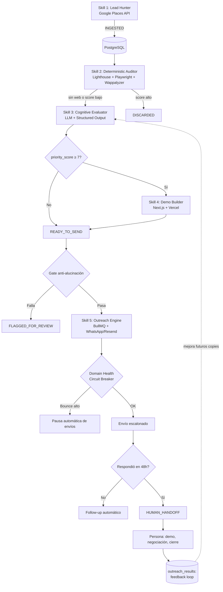

# Blueprint Técnico v3.0 (Final) — Agente de Prospección B2B
### Modelo operativo: el agente prospecta, el humano cierra

**Rol:** Senior Software Architect & Lead Engineer
**Filosofía del sistema:** el agente es 100% autónomo en todo lo repetitivo y de bajo riesgo (buscar, auditar, calificar, contactar, dar seguimiento). El cierre — negociación, demo en vivo, firma — siempre pasa por una persona. Ningún lead se reprocesa dos veces por la misma skill: el `status` en base de datos es la única fuente de verdad.

---

## 0. Fase de Validación Manual (Semana 0 — antes de programar)

No se escribe pipeline completo hasta validar mercado:

1. Elegir **un solo nicho** y **una sola geografía** (no tres nichos como en el borrador original).
2. Extraer 30-50 leads manualmente (Google Maps + Lighthouse online gratuito).
3. Auditar y contactar a mano por WhatsApp con el mismo tipo de mensaje que usará el agente.
4. Umbral de decisión: si la tasa de respuesta es **< 10%**, el problema es el mensaje/nicho, no la automatización — ajustar antes de construir nada.
5. En paralelo: registrar el dominio secundario de outreach y comenzar el warmup de 14 días (SPF/DKIM/DMARC). Es lo más lento del proyecto — debe arrancar desde el día 1, no al final.

Solo si el paso 4 da señal positiva, se pasa a construcción.

---

## 1. División de Responsabilidades: Agente vs. Humano

| Etapa | Responsable | Autonomía |
|---|---|---|
| Búsqueda y extracción de leads | Agente | Total |
| Auditoría técnica (Lighthouse, stack) | Agente | Total |
| Diagnóstico y generación de propuesta | Agente | Total |
| Primer mensaje de contacto | Agente | Automática, con gate de validación previo |
| Seguimiento (follow-up 48h/72h) | Agente | Total |
| **Respuesta del prospecto en adelante** | **Humano** | El agente notifica, no negocia |
| Demo en vivo / llamada | Humano | Total |
| Negociación y ajuste de alcance | Humano | Total |
| Cierre y firma | Humano | Total |

El punto de corte exacto es el evento `REPLIED`: ahí el lead pasa a `HUMAN_HANDOFF` y el agente deja de actuar sobre ese lead salvo para registrar el resultado final (`WON`/`LOST`) en el CRM.

---

## 2. Máquina de Estados (fuente única de verdad — evita reprocesos)

```
INGESTED
   │  Skill 1 no vuelve a tocar este lead nunca más
   ▼
AUDITED_QUALIFIED ──► DISCARDED
   │  Skill 2 corre una sola vez; reintentos internos (max 2) antes de DISCARDED
   ▼
PROPOSAL_COMPILED
   │  Skill 3 usa solo audit_diagnostics, nunca re-audita
   ▼
DEMO_DEPLOYED (opcional, solo si priority_score ≥ 7) ──┐
   │                                                     │
   ▼                                                     ▼
READY_TO_SEND ◄─────────────────────────────────────────┘
   │  Gate de validación automática (anti-alucinación)
   ├──► FLAGGED_FOR_REVIEW (cola humana, no se reintenta solo)
   ▼
QUEUED ──► SENT
              │  48h sin respuesta
              ▼
         FOLLOWUP_SENT ──► (72h) ──► FOLLOWUP_2 ──► COLD
              │
              └──► REPLIED ──► HUMAN_HANDOFF ──► WON / LOST
```

**Regla de idempotencia:** cada skill hace `UPDATE ... SET status = 'Y' WHERE status = 'X'` de forma atómica. Ninguna skill consulta leads fuera de su estado de entrada esperado — así, aunque corran varios workers en paralelo, un lead nunca se procesa dos veces en la misma etapa.

---

## 3. Diagrama de Arquitectura



---

## 4. Skills — Especificación (sin solapamientos de responsabilidad)

### Skill 1 — Lead Hunter & Discovery
- **Motor:** Google Places API (no scraping directo de Maps)
- **Idempotencia:** `place_id` único con `ON CONFLICT DO NOTHING`
- **Alcance del MVP:** un solo nicho + una sola geografía (ver Fase 0)
- **Salida:** `status = INGESTED`

### Skill 2 — Deterministic Web Auditor
- **Motor:** Lighthouse CLI + Playwright + Wappalyzer
- **Entrada exclusiva:** `WHERE status = 'INGESTED'`
- **Reintentos:** máx. 2 ante fallo técnico, luego `DISCARDED` (nunca vuelve a `INGESTED`)
- **Salida:** `AUDITED_QUALIFIED` o `DISCARDED`

### Skill 3 — Cognitive Opportunity Evaluator
- **Motor:** Claude con **structured output** (tool use, no parseo de texto libre)
- **Entrada exclusiva:** `WHERE status = 'AUDITED_QUALIFIED'` + el JSON de `audit_diagnostics` (nunca vuelve a auditar)
- **Mejora continua:** usa como few-shot los 3-5 mensajes con mejor tasa de respuesta histórica del mismo nicho (tabla `outreach_results`)
- **Salida:** `PROPOSAL_COMPILED`

### Skill 4 — Automated Mockup & Demo Builder
- **Condición de entrada:** `priority_score >= 7` — evita gastar cómputo en leads de bajo ticket
- **Salida:** `DEMO_DEPLOYED`

### Skill 5 — Smart Multi-Channel Outreach & CRM Sync
- **Gate previo obligatorio:** valida que el nombre de empresa, las métricas citadas y la ausencia de placeholders sean correctos antes de encolar — si falla, va a `FLAGGED_FOR_REVIEW`, nunca se envía a ciegas
- **Circuit breaker:** si `bounce_rate_24h` supera el umbral, se pausan todos los envíos automáticamente
- **Límite de autonomía:** el agente ejecuta hasta el primer contacto y los follow-ups automáticos. En cuanto el estado pasa a `REPLIED`, deja de actuar — solo notifica y sincroniza CRM. **El cierre es humano.**

---

## 5. Esquema SQL

```sql
CREATE TYPE lead_status AS ENUM (
    'INGESTED','AUDITED_QUALIFIED','DISCARDED','AUDIT_FAILED',
    'PROPOSAL_COMPILED','DEMO_DEPLOYED','READY_TO_SEND',
    'FLAGGED_FOR_REVIEW','QUEUED','SENT','FOLLOWUP_SENT',
    'FOLLOWUP_2','COLD','REPLIED','HUMAN_HANDOFF','WON','LOST'
);

CREATE TABLE prospect_leads (
    id UUID PRIMARY KEY DEFAULT gen_random_uuid(),
    place_id VARCHAR UNIQUE NOT NULL,
    business_name VARCHAR NOT NULL,
    niche VARCHAR,
    phone VARCHAR,
    whatsapp VARCHAR,
    email VARCHAR,
    google_maps_url TEXT,
    rating DECIMAL,
    reviews_count INT,
    current_website_url TEXT,
    status lead_status DEFAULT 'INGESTED',
    retry_count INT DEFAULT 0,
    do_not_contact BOOLEAN DEFAULT FALSE,
    assigned_closer VARCHAR,          -- persona responsable del cierre tras REPLIED
    created_at TIMESTAMP DEFAULT now(),
    updated_at TIMESTAMP DEFAULT now()
);

CREATE TABLE audit_diagnostics (
    id UUID PRIMARY KEY DEFAULT gen_random_uuid(),
    lead_id UUID REFERENCES prospect_leads(id),
    has_website BOOLEAN,
    is_mobile_responsive BOOLEAN,
    lighthouse_perf_score INT,
    ttfb_ms INT,
    detected_tech_stack JSONB,
    ai_opportunity_type VARCHAR,
    demo_url_deployed TEXT,
    created_at TIMESTAMP DEFAULT now()
);

CREATE TABLE outreach_results (
    id UUID PRIMARY KEY DEFAULT gen_random_uuid(),
    lead_id UUID REFERENCES prospect_leads(id),
    channel VARCHAR(20),
    sent_at TIMESTAMP,
    replied BOOLEAN DEFAULT FALSE,
    converted BOOLEAN DEFAULT FALSE,
    copy_used TEXT
);

CREATE TABLE domain_health (
    id UUID PRIMARY KEY DEFAULT gen_random_uuid(),
    domain VARCHAR NOT NULL,
    bounce_rate_24h DECIMAL DEFAULT 0,
    spam_complaints INT DEFAULT 0,
    circuit_breaker_active BOOLEAN DEFAULT FALSE,
    checked_at TIMESTAMP DEFAULT now()
);
```

---

## 6. Esquema JSON Estructurado (Skill 3, vía tool use)

```json
{
  "name": "compile_opportunity_report",
  "input_schema": {
    "type": "object",
    "required": ["lead_id", "opportunity_type", "priority_score", "pain_points", "outreach_copy"],
    "properties": {
      "lead_id": { "type": "string" },
      "opportunity_type": {
        "type": "string",
        "enum": ["NEW_WEBSITE", "MODERNIZATION", "PERFORMANCE_OVERHAUL", "SYSTEM_INTEGRATION"]
      },
      "priority_score": { "type": "integer", "minimum": 1, "maximum": 10 },
      "pain_points": { "type": "array", "items": { "type": "string" }, "maxItems": 4 },
      "proposed_solution": { "type": "string" },
      "outreach_copy": {
        "type": "object",
        "required": ["whatsapp_pitch", "email_subject", "email_body"],
        "properties": {
          "whatsapp_pitch": { "type": "string" },
          "email_subject": { "type": "string" },
          "email_body": { "type": "string" }
        }
      }
    }
  }
}
```

---

## 7. Anti-Spam y Plan B de Canal

- **Warmup de dominio:** 14 días mínimo, dominio secundario nunca el corporativo principal, SPF+DKIM+DMARC configurados desde el día 1 (arranca en Fase 0, en paralelo).
- **Riesgo de bloqueo de WhatsApp Business API:** tener Email + LinkedIn configurados como canal alterno desde el inicio, no como reacción a una crisis.
- **Circuit breaker:** pausa automática de envíos si `bounce_rate_24h` o quejas de spam superan el umbral definido en `domain_health`.

---

## 8. Prevención de Bloqueo de WhatsApp Business API

Riesgo crítico del canal principal de outreach — requiere reglas explícitas, no solo "enviar con delays":

1. **Usar únicamente la Cloud API oficial de WhatsApp Business**, directo con Meta o vía un BSP (Twilio, 360dialog, Gupshup). Descartar librerías no oficiales (Baileys, whatsapp-web.js) que simulan un navegador — violan ToS y el riesgo de bloqueo es alto.
2. **Respetar la ventana de 24 horas:**
   - Primer contacto en frío → obligatorio usar **plantilla (template) pre-aprobada por Meta**, nunca texto libre.
   - Texto libre (session message) solo dentro de las 24h posteriores a que el prospecto responde.
3. **Escalar el tier de envío gradualmente.** Números nuevos inician en ~250 mensajes/día; Meta sube el límite automáticamente si se mantiene buena calidad. No forzar volumen alto desde el día 1.
4. **Monitorear el Quality Rating del número** (Green/Yellow/Red) desde el Business Manager — se basa en bloqueos de usuarios, reportes de spam y tasa de respuesta. El `domain_health`/circuit breaker debe incorporar esta métrica junto al bounce rate de email.
5. **Personalizar con datos verificables del negocio** (rating, ausencia de web, velocidad de carga), no solo insertar el nombre en una plantilla genérica — reduce la probabilidad de ser marcado como spam masivo.
6. **Respetar `do_not_contact` de forma estricta** y no reintentar indefinidamente a quien no responde — los reportes de spam son la causa más rápida de degradar la calidad del número.
7. **Separar el número de outreach frío del número de soporte/ventas activo**, para que un problema de calidad en frío no contamine el canal con clientes que ya confían en la marca.
8. **Mantener el canal alterno (Email/LinkedIn) siempre operativo** (ver sección 7), para que una suspensión de WhatsApp no detenga el pipeline completo.

---

## 9. KPIs a Medir Desde el Lead #1

No se agregan más features (Skill 4, feedback loop) sin estos datos activos:

- Tasa de respuesta por nicho
- Costo por lead calificado (Google Places API + Lighthouse + tokens LLM)
- Costo por respuesta obtenida
- Tiempo desde `INGESTED` hasta primer contacto humano (`HUMAN_HANDOFF`)
- Tasa de conversión de `HUMAN_HANDOFF` a `WON`

---

## 10. Presupuesto de Componentes (a estimar antes de construir)

| Componente | Costo variable por |
|---|---|
| Google Places API | request |
| Cómputo Lighthouse/Playwright | por auditoría (servidor propio) |
| Tokens LLM (Skill 3) | por lead evaluado |
| Vercel (Skill 4) | por demo desplegada |
| WhatsApp Business API | por conversación/mensaje |
| Resend / Email | por envío |

---

## 11. Roadmap de Implementación

1. **Semana 0:** Validación manual (sección 0). Arrancar warmup de dominio en paralelo.
2. **Semana 1-2:** Skills 1-2 (scraping + auditoría) para el nicho único validado. Sin LLM todavía.
3. **Semana 3:** Skill 3 con structured output. Probar contra los mismos 50 leads de la validación manual, sin enviar nada.
4. **Semana 4:** Gate de validación anti-alucinación + `domain_health` con circuit breaker. Va antes que Skill 5 en producción.
5. **Semana 5:** Skill 5 en modo semiautónomo (cola humana obligatoria) durante los primeros 50-100 envíos. Definir quién es el "closer" humano y su flujo de trabajo desde `HUMAN_HANDOFF`.
6. **Semana 6+:** Activar envío directo automático solo si KPIs (sección 8) son estables. Activar feedback loop. Evaluar Skill 4 (demos) solo si el volumen de leads de alto ticket lo justifica.
7. **Continuo:** replicar el mismo pipeline a un segundo nicho solo después de que el primero tenga métricas positivas sostenidas.

---

## 12. Checklist Antes de Escribir Código

- [ ] Nicho único y geografía única definidos
- [ ] 30-50 leads validados manualmente con tasa de respuesta ≥ 10%
- [ ] Dominio secundario registrado y warmup iniciado
- [ ] Persona(s) responsable(s) del cierre humano identificada(s)
- [ ] KPIs y su método de medición definidos
- [ ] Presupuesto estimado por lead calificado calculado
- [ ] Canal alterno (Email/LinkedIn) configurado como respaldo
- [ ] Número de WhatsApp Business verificado con la Cloud API oficial (no librería no oficial)
- [ ] Al menos una plantilla de primer contacto aprobada por Meta
