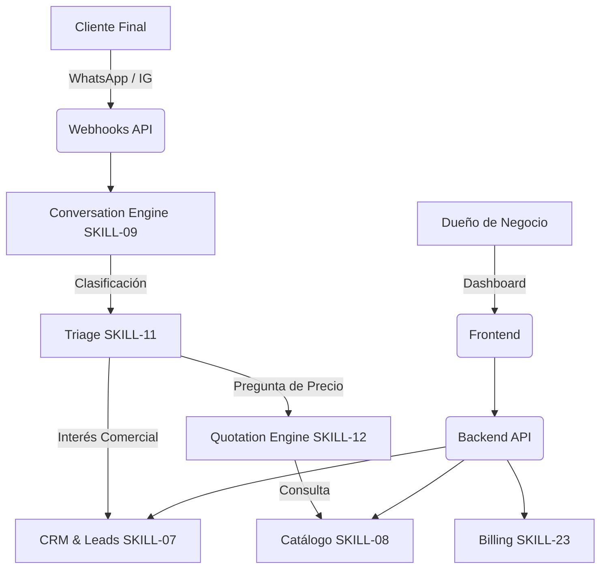

# ARQUITECTURA DEL SISTEMA: Smart Publish AI

Este documento es generado por **SKILL-03 (ARQUITECTURA)**. Define el esqueleto tecnológico, qué corre dónde y cómo se comunican las capas. **Nota**: Las tablas detalladas de la base de datos se delegan exclusivamente a `SKILL-04 (Data)`.

## 1. Capas y Tecnologías

| Componente | Tecnología Principal | Responsabilidad |
|---|---|---|
| **Frontend** | React / Next.js (Heredado de Smart Publish) | Interfaz gráfica (Dashboard, CRM visual, Configuración de Billing y Redes). |
| **Backend / API** | Node.js (TypeScript) + Express | Lógica de negocio (Billing, CRM, Endpoints, Integraciones con Redes Sociales). |
| **Workers / Colas** | Redis / BullMQ | Tareas en segundo plano (Envío de campañas, limpieza de tokens, jobs programados). |
| **IA (Conversation Engine)** | OpenAI / Gemini API | Clasificación de intenciones (Triage), generación de respuestas y extracción de entidades. |
| **Base de Datos** | PostgreSQL / MySQL (Relacional) | Almacenamiento transaccional de usuarios, leads, catálogos e historial de pagos. |
| **Storage** | AWS S3 / Local (Multer) | Almacenamiento de imágenes, catálogos en PDF y recursos generados. |
| **Webhooks** | Node.js (Endpoints dedicados) | Recepción de mensajes entrantes (WhatsApp, FB Messenger, Webhooks de pago). |

## 2. Diagrama de Flujo (Qué servicio llama a cuál)

## 3. Reglas de Frontera (Qué información atraviesa cada capa)

1. **La IA NO se conecta directamente a la Base de Datos:**
   - Si la IA necesita un precio, el Orquestador llama a la API del Catálogo, obtiene un JSON y se lo pasa a la IA como contexto (Prompt Injection / Function Calling).
2. **Los Webhooks NO procesan lógica pesada:**
   - El webhook (ej. Meta API) recibe el mensaje, lo encola (Redis) y responde `200 OK` inmediatamente. Un Worker procesa la conversación.
3. **Aislamiento Multi-Tenant (SaaS):**
   - Todas las llamadas al Backend desde el Frontend deben incluir el `tenant_id` o derivarlo del Token JWT (SKILL-05). La IA también recibe el `tenant_id` para cargar solo el contexto de esa empresa.

## 4. Testing Automático (Playwright)
- Playwright (SKILL-26) correrá contra entornos de Staging/Desarrollo simulando tanto al Administrador (Dashboard) como al Cliente Final (Webhooks mockeados) para garantizar que los flujos de facturación y chat no se rompan.
