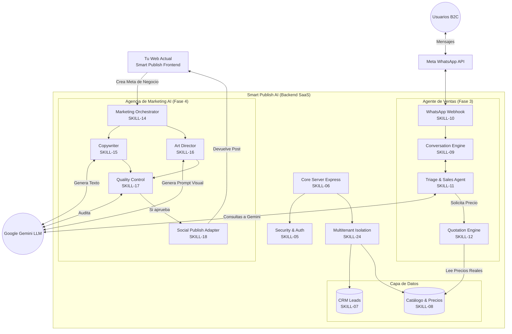
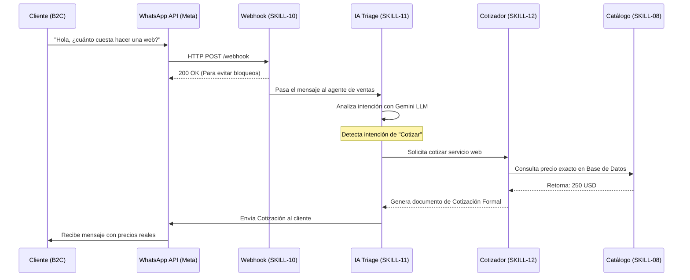
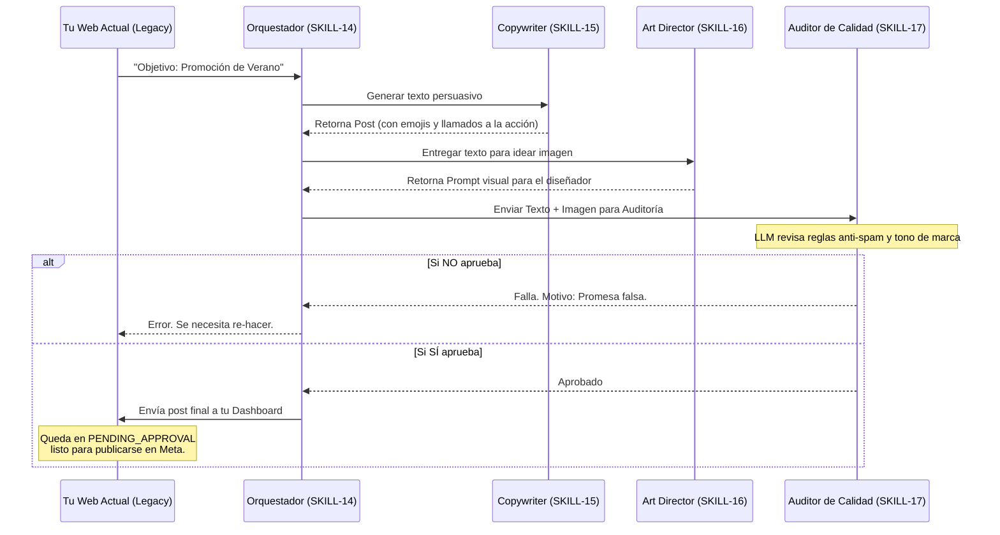

# Diagramas de Arquitectura y Procesos (Smart Publish AI)

Basado en el ejemplo visual que me enviaste y en todo el código que hemos construido, he diseñado estos diagramas técnicos utilizando la notación `Mermaid`. 

Estos gráficos representan exactamente la estructura real de tu servidor actual.

## 1. Diagrama de Arquitectura Global (Todo lo programado)
Este diagrama muestra cómo se conectan los módulos principales de tu sistema (Core, Datos, Agentes de Ventas y Agencia de Marketing) y cómo interactúan con el mundo exterior.

---

## 2. Diagramas de Procesos
Aquí te detallo el "Paso a Paso" de cómo interactúan los agentes de Inteligencia Artificial para resolver tareas específicas sin intervención humana.

### A. Proceso de Ventas 24/7 (B2B2C)
Este es el flujo que ocurre en milisegundos cuando un cliente final escribe a tu WhatsApp de madrugada preguntando por un precio.

### B. Proceso de Creación de Marketing
Este es el flujo cuando el dueño del negocio (B2B) entra a tu plataforma web y le pide a la Inteligencia Artificial que le arme una campaña completa.

